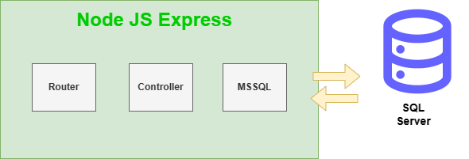
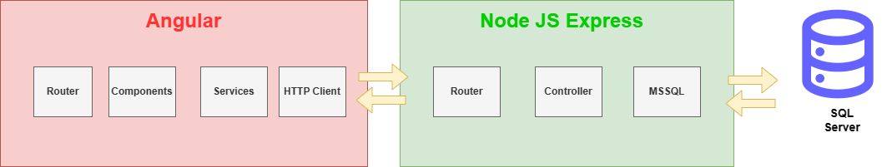

# Back-end Prueba AgendaContacto

Este repositorio corresponde a la parte back-end de la prueba tecnica agenda de contacto.

**Enunciado:** se desea crear una agenda personal. Debe permitirse registrar
contactos, incluyendo el nombre completo, el número de documento, la
dirección, número telefónico de contacto, dirección de correo electrónico.
Aclárese que debe permitirse el registro de más de un número telefónico, así
como más de una dirección de correo electrónico. Debe poderse listar los
contactos con su información completa, así como permitirse la modificación y
eliminación de estos.

**Evidencia Funcionalidad:** https://www.youtube.com/watch?v=feRjORYGb_A

## Requisitos del Sistema
- Node.js
- NPM (Node Package Manager)
- Sql Server
- Git

## Instalación
- Clona el repositorio del backend desde URL del repositorio.
- Navega al directorio del proyecto.
- Ejecuta npm install para instalar las dependencias.

## Stack Tecnologico

Este projecto esta desarrollado con las siguietes tecnologias: 

- [Node.js](https://nodejs.org/en/about) version 16.2.4
- [express](https://expressjs.com/) version 5.0.3
- [dotenv](https://www.dotenv.org/docs/) version 5.0.3
- [cors](https://www.npmjs.com/package/cors) version 2.8.5
- [mssql](https://github.com/tediousjs/node-mssql#readme) version 10.0.1
- [nodemon](https://nodemon.io/) version3.0.1

## Variables de Entorno

```shell
Puerto
PORT = 3000

Credenciales DataBase
DB_HOST = localhost
DB_USER = sa
DB_PASSWORD = 12345678
DB = agenda_personal
DB_PORT = 1433

Cors 
Front = http://localhost:4200
```


## Ejecucion Proyecto
Para iniciar el servidor, ejecuta el siguiente comando:

### Iniciar Servidor
A continuacion detallremos las instrucciones para la ejecucion del proyecto.

```shell
npm run start
```
### Endpoints de la API

El backend proporciona una serie de endpoints para interactuar con el front-end:

- GET /contact
- POST /contact
- PUT /contact/:id
- DELETE /contact/:id


## Base de Datos

Esta documentación describe la estructura y el diseño de la base de datos utilizada en el proyecto . Proporciona información detallada sobre las tablas, campos, relaciones y otros aspectos importantes de la base de datos.

### Resumen
- Nombre de la Base de Datos: agenda_personal
- Tipo de Sistema de Gestión de Base de Datos (SGBD): [sqlServer](https://www.microsoft.com/es-mx/sql-server/sql-server-2022)
- Versión del SGBD: [2022]

### Restaurar Base de Datos
En el repositorio encontraran  una carpta con el nombre backupdatabase en el que se encutra el archinvo script.ipynb que indica como hacer el respectivo proceso


### Relación


## Estructura Empleada
A continuacion detallamos la estructura aplicada en el  freamwork  de Node.js .




Adicional a esto, este back-end junto al repositorio de [fron-end](https://github.com/josemasster/PruebaTecnica-Front) conforman la solución de la prueba.

A continuacion se muestra la arquitectura global


